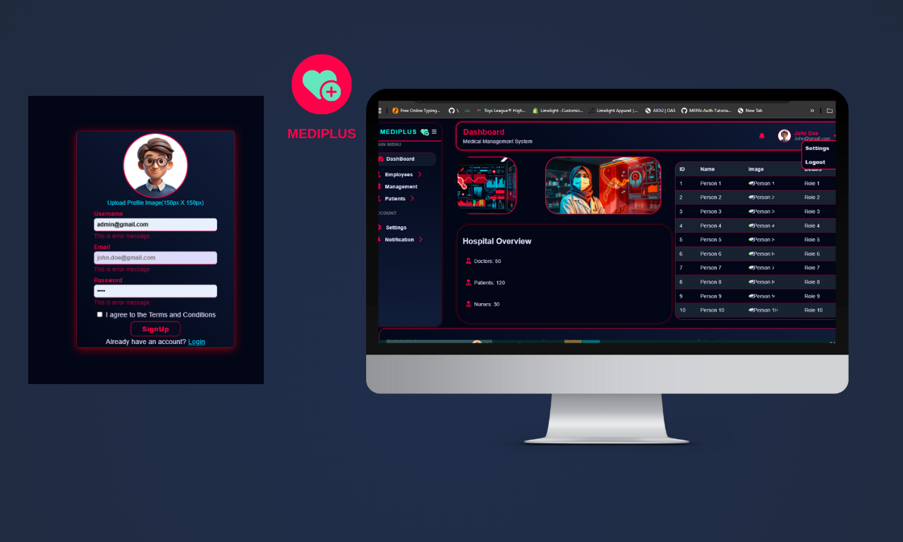
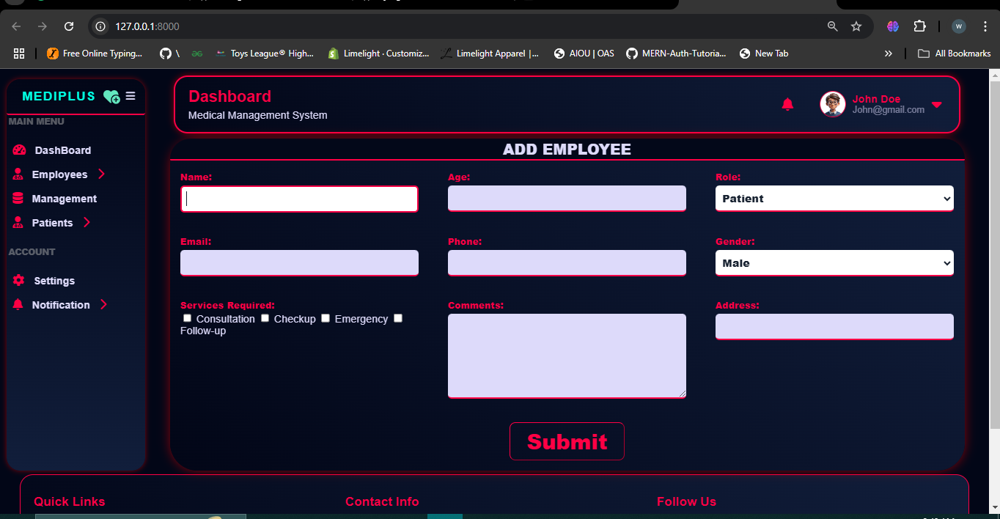
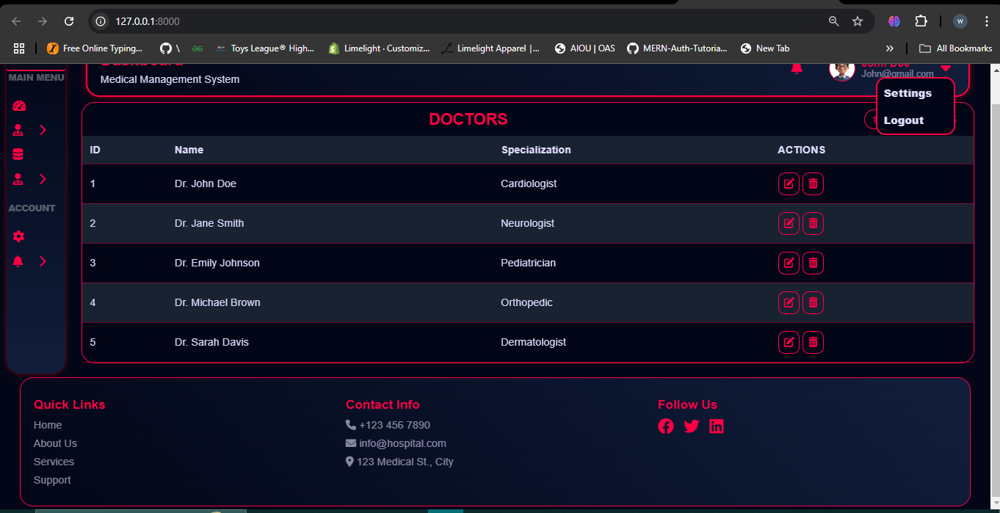

# Medical Dashboard UI Development

A modern and minimal front-end design for a medical dashboard, developed from scratch for seamless integration with a Django backend. The project focuses on providing a clean user interface and a user-friendly experience.

## Features

- **Responsive Layout**: Works well on all desktop screens.
- **Data Input Forms**: User-friendly forms for efficient data entry.
- **Data Display Tables**: Well-organized tables for easy information management.
- **Intuitive Navigation**: Includes a header, footer, and sidebar for smooth navigation.
- **Modern & Minimal Design**: Simple, clean, and focused on user experience.

## Dashboard

## FORM

## TAble for Data representation



## Setup Instructions

### Prerequisites

- Python installed on your system
- Virtual environment package (e.g., `venv` or `virtualenv`)
- Django framework

### Steps to Run the Project

1. **Clone the Repository:**
   ```bash
   git clone https://github.com/username/repository-name.git
   cd repository-name
